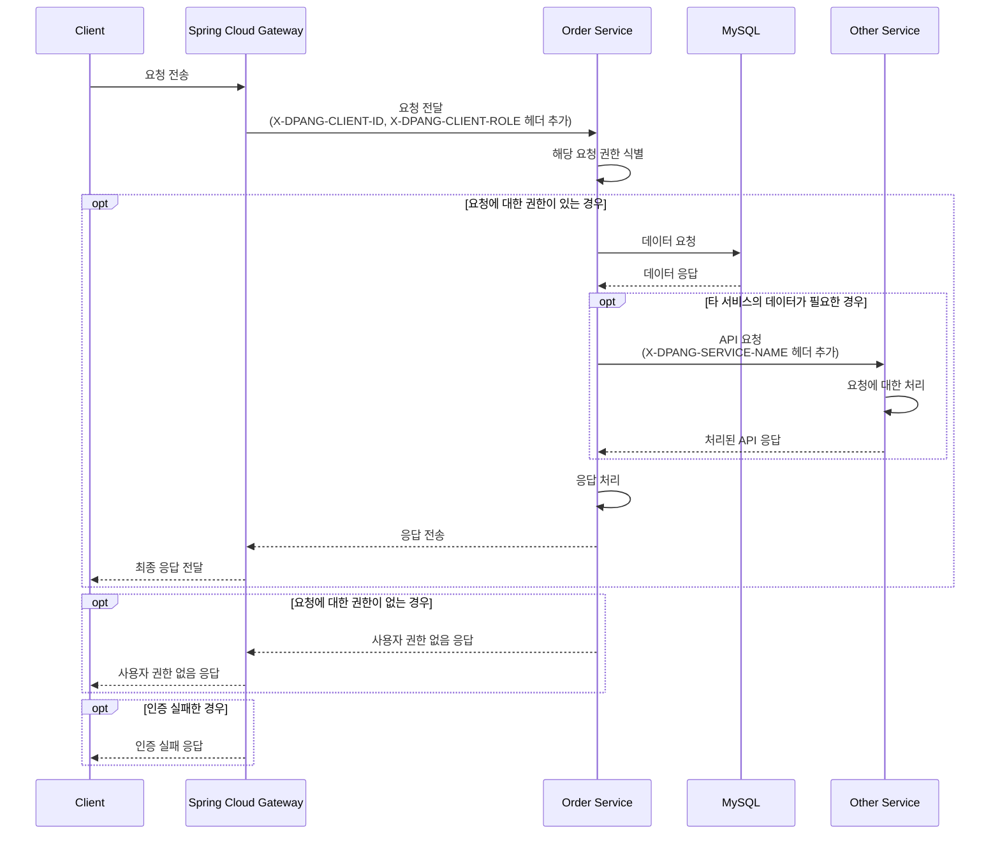
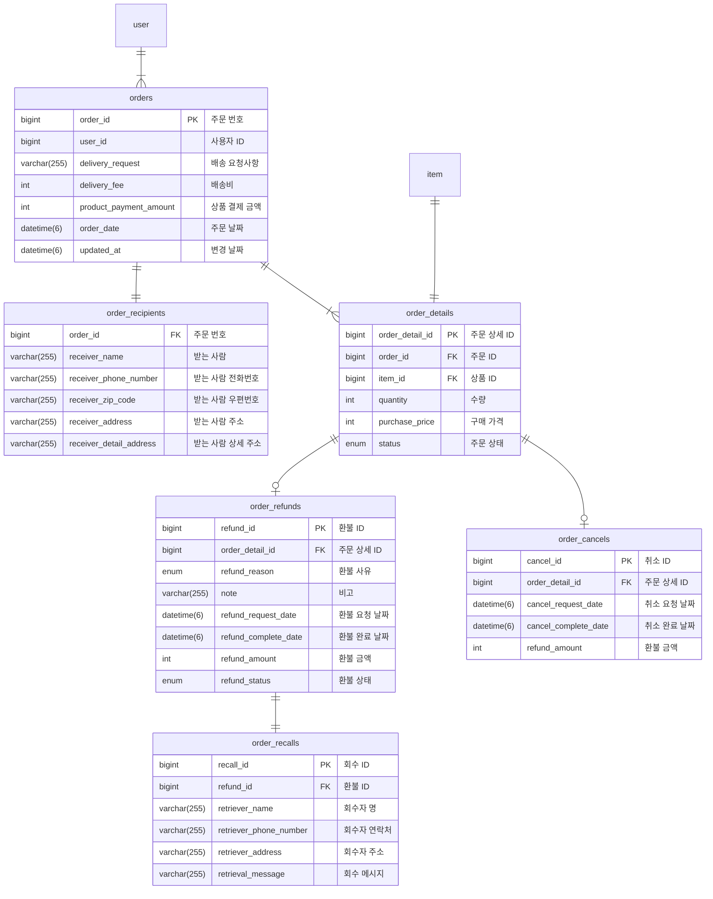

# DPANG ORDER SERVER

## 🌐 프로젝트 개요

이 프로젝트는 주문 서비스를 지원하는 마이크로서비스로서, 사용자의 주문, 환불, 취소 등 주문 관련 기능을 제공합니다.

이를 통해 사용자의 주문 관련 작업을 효율적으로 관리하고, 사용자 경험을 향상시키는데 중점을 두고 있습니다.

## 🔀 프로젝트 아키텍처

아래의 시퀀스 다이어그램은 본 프로젝트의 주요 컴포넌트인 Spring Cloud Gateway, 주문 서비스, 그리고 타 서비스 간의 상호작용을 보여줍니다.



이 시퀀스 다이어그램을 통해 볼 수 있듯이, 모든 클라이언트 요청은 먼저 Spring Cloud Gateway를 통해 전달됩니다.

Gateway는 클라이언트의 요청에 대한 토큰을 분석하고, 사용자의 ID와 Role 정보를 추출하여
'X-DPANG-CLIENT-ID'와 'X-DPANG-CLIENT-ROLE'이라는 사용자 정의 헤더에 추가하여 주문 서비스에 전달합니다.

주문 서비스는 해당 요청에 대한 권한을 식별하고, 권한이 있는 경우에만 요청을 처리합니다.

권한이 있는 경우, 주문 서비스는 MySQL 데이터베이스에서 필요한 데이터를 요청하고, 그 데이터를 다시 클라이언트에게 반환합니다.

만약 해당 요청에 대한 데이터가 다른 서비스에서 필요한 경우, 주문 서비스는 해당 서비스에 API 요청을 전달하고, 그 처리 결과를 다시 클라이언트에게 반환합니다.

만약 해당 요청에 대한 권한이 없는 경우, 주문 서비스는 클라이언트에게 '사용자 권한 없음' 응답을 반환하며

해당 요청에 대한 인증이 실패한 경우, Gateway는 클라이언트에게 '인증 실패' 응답을 반환합니다.

## 🗃️ 데이터베이스 구조

주문 서비스에서는 주문과 관련된 정보를 관리하기 위해 MySQL 데이터베이스를 사용하고 있습니다.

아래의 ERD는 주문 서비스에서 사용하는 데이터베이스의 구조를 보여줍니다.



## ✅ 프로젝트 실행

해당 프로젝트를 추가로 개발 혹은 실행시켜보고 싶으신 경우 아래의 절차에 따라 진행해주세요

#### 1. `secret.yml` 생성

```commandline
cd ./src/main/resources
touch secret.yml
```

#### 2. `secret.yml` 작성

```yaml
spring:
  datasource:
    driver-class-name: com.mysql.cj.jdbc.Driver
    url: jdbc:mysql://{YOUR_DB_HOST}:{YOUR_DB_PORT}/{YOUR_DB_NAME}
    username: { YOUR_DB_USERNAME }
    password: { YOUR_DB_PASSWORD }

  application:
    name: order-server

eureka:
  instance:
    prefer-ip-address: true

  client:
    register-with-eureka: true
    fetch-registry: true
    service-url:
      defaultZone: http://{YOUR_EUREKA_SERVER_IP}:{YOUR_EUREKA_SERVER_PORT}/eureka/

```

#### 3. 프로젝트 실행

```commandline
./gradlew bootrun
```

**참고) 프로젝트가 실행 중인 환경에서 아래 URL을 통해 API 명세서를 확인할 수 있습니다**

```commandline
http://localhost:8080/swagger-ui/index.html
```