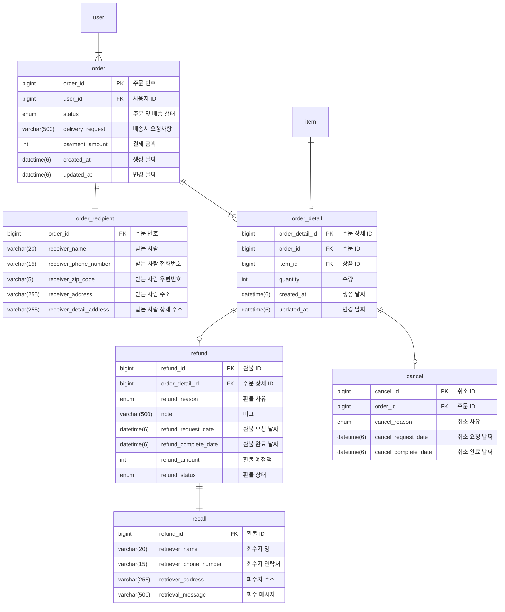

# order-server

```mermaid
erDiagram
  order {
    bigint order_id PK "주문 번호"
    bigint user_id FK "사용자 ID"
    enum status "주문 및 배송 상태"
    varchar(500) delivery_request "배송시 요청사항"
    int payment_amount "결제 금액"
    datetime(6) created_at "생성 날짜"
    datetime(6) updated_at "변경 날짜"
  }

  order_recipient {
    bigint order_id FK "주문 번호"
      varchar(20) receiver_name "받는 사람"
      varchar(15) receiver_phone_number "받는 사람 전화번호"
      varchar(5) receiver_zip_code "받는 사람 우편번호"
      varchar(255) receiver_address "받는 사람 주소"
      varchar(255) receiver_detail_address "받는 사람 상세 주소"
   }

  order_detail {
    bigint order_detail_id PK "주문 상세 ID"
    bigint order_id FK "주문 ID"
    bigint item_id FK "상품 ID"
    int quantity "수량"
    datetime(6) created_at "생성 날짜"
    datetime(6) updated_at "변경 날짜"
  }

  refund {
    bigint refund_id PK "환불 ID"
    bigint order_detail_id FK "주문 상세 ID"
    enum refund_reason "환불 사유"
    varchar(500) note "비고"
    datetime(6) refund_request_date "환불 요청 날짜"
    datetime(6) refund_complete_date "환불 완료 날짜"
    int refund_amount "환불 예정액"
    enum refund_status "환불 상태"
  }

  recall {
    bigint refund_id FK "환불 ID"
    varchar(20) retriever_name "회수자 명"
    varchar(15) retriever_phone_number "회수자 연락처"
    varchar(255) retriever_address "회수자 주소"
    varchar(500) retrieval_message "회수 메시지"
  }

  cancel {
    bigint cancel_id PK "취소 ID"
    bigint order_id FK "주문 ID"
    enum cancel_reason "취소 사유"
    datetime(6) cancel_request_date "취소 요청 날짜"
    datetime(6) cancel_complete_date "취소 완료 날짜"
  }

  order ||--|{ order_detail: ""
  order_detail ||--o| refund: ""
  order ||--|| order_recipient: ""
  order_detail ||--o| cancel: ""
  refund ||--|| recall: ""
  user ||--|{ order: ""
  item ||--|| order_detail: ""
    
```